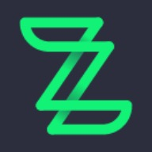

 
  🌎 Hi There! My name is Gabriel Merigo and I'm <strong>Front-End Developer.</strong>

  💼 Tools: <strong>VSCode, Figma, Insomnia, Vercel, Git e GitHub</strong>

  💌 if you want talk with me, you can send me a message

  
  
  

### Experience of Work
On below, you'll see my experience of work:

[**Zallpy Digital**](https://www.instagram.com/zallpydigital/) \
 Full-time • 1 year and 5 months\
Services: `Frontend Developer`
 
 
 

[**Hartb**](https://hartbgroup.com/tag/outsourcing/) \
 Part-time • 5 months \
Services: `Frontend Developer`
 
 

### 🦄 Skills

  
   
   
  
   
   
   
  
  
  
  
  
  
  
  
  

